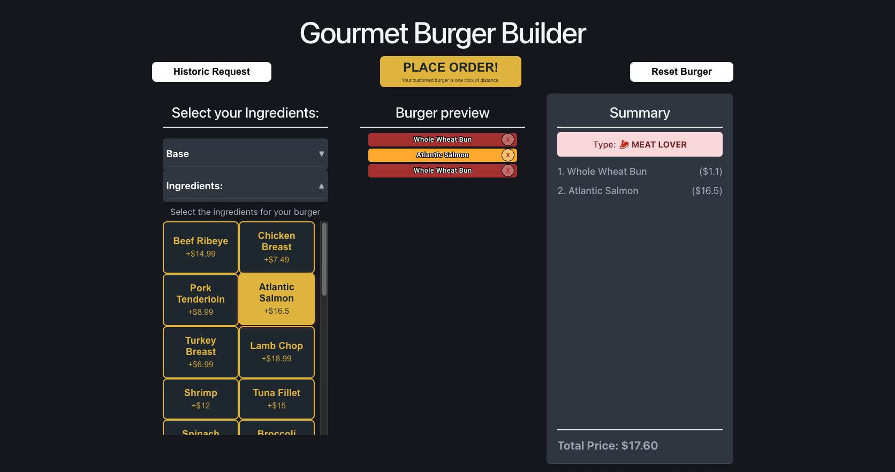
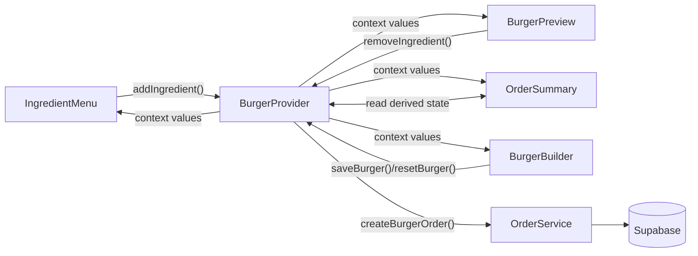
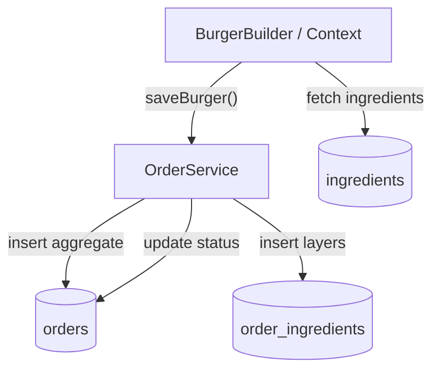

# Project Description

Gourmet Burger Builder POC is a purely frontend proof of concept built with React, TypeScript, and Vite. It provides an interactive interface that allows users to dynamically assemble their own gourmet burger, with immediate visual and data-driven feedback as ingredients are selected.

# Features

- Clickable ingredients: All ingredients present in the database.
- Real-time updates: Instant calculation of total price, total calories, and a dynamic chef’s rating badge.
- Visual layers: Displays burger layers in the exact order they were added by the user.
- Order placement: A functional “Place Order” button to complete the creation.

# Screenshot



# Architecture and Implementation

## Global State Management Architecture (Context API)

The Burger Builder uses React Context as the application's shared state boundary. This is the correct architectural choice for a POC with multiple deeply nested presentation components because the burger state is cross-cutting: the ingredient menu mutates it, the preview renders it, the summary derives from it, and the order controls orchestrate the final persistence step.

At the core, the context is created with an explicit `undefined` default and consumed through a custom hook:

```tsx
const BurgerContext = createContext<BurgerContextType | undefined>(undefined);

export function useBurgerBuilder() {
  const context = useContext(BurgerContext);
  if (!context) {
    throw new Error('useBurger should be use inside BurgerProvider');
  }
  return context;
}
```

This pattern is intentionally defensive. By failing fast when the provider is missing, the implementation prevents silent runtime corruption and makes architectural violations obvious during development.

The `BurgerProvider` acts as the single source of truth for the burger lifecycle:

```tsx
const [burgerIngredients, setBurgerIngredients] = useState<Ingredients[]>([]);
const [burgerBase, setBurgerBase] = useState<Ingredients | null>(null);
const totalPrice = burgerIngredients.reduce((sum, ing) => sum + ing.price, basePrice);
const totalCalories = burgerIngredients.reduce((sum, ing) => sum + ing.calories, baseCalories);
```

The provider centralizes:

- Ingredient composition, including the base layer and all add-on layers.
- Derived business metrics such as total price and total calories.
- Order lifecycle state through `isOrdering`.
- Action methods such as `addIngredient`, `removeIngredient`, `resetBurger`, and `saveBurger`.

This eliminates prop drilling across `IngredientMenu`, `BurgerPreview`, `OrderSummary`, and `BurgerBuilder`. More importantly, it keeps business rules colocated with the state that owns them, which reduces the probability of inconsistent UI behavior.



## Core Hooks Mastery & Performance Optimization

The codebase uses hooks in a way that maps directly to React's separation of concerns:

- `useState` manages local UI state that does not belong in the global burger model.
- `useEffect` handles one-time fetches and lifecycle-driven timers.
- `useCallback` and `useMemo` are the natural optimization primitives for this architecture when the component tree or data volume grows.

### Local UI State with `useState`

`IngredientMenu` owns UI affordances such as section expansion, while `BurgerBuilder` and the provider keep track of ordering locks:

```tsx
const [isBaseOpen, setIsBaseOpen] = useState<boolean>(true);
const [isIngredientsOpen, setIsIngredientsOpen] = useState<boolean>(false);
```

This is the right scope for transient UI state because it is purely presentational. Keeping it local avoids polluting the global burger model with concerns that are irrelevant to data persistence.

### Side Effects with `useEffect`

The ingredient catalog is loaded once on mount, and the order completion flow uses a timeout to restore the UI after the simulated post-order delay:

```tsx
useEffect(() => {
  async function obtenerDatos() {
    const { data, error } = await supabase.from('ingredients').select('*');
    if (!error) {
      setBaseIngredients(data.filter((ingredient: Ingredients) => ingredient.type.includes('base')));
      setNormalIngredients(data.filter((ingredient: Ingredients) => !ingredient.type.includes('base')));
    }
  }
  obtenerDatos();
}, []);
```

```tsx
useEffect(() => {
  if (!isOrdering) {
    const timer = setTimeout(() => {
      setIsOrdering(true);
      alert('✅ Success! Enjoy your meal!!');
    }, 10000);

    return () => clearTimeout(timer);
  }
}, [isOrdering]);
```

The cleanup phase is essential. Without `clearTimeout`, the component could attempt to update state after unmount, which introduces memory leaks and hard-to-trace UI bugs.

### Memoization Strategy with `useMemo` and `useCallback`

The current implementation computes totals directly inside the provider, which is acceptable for a POC because the dataset is small and the calculations are cheap. However, the architecture is already shaped for memoization:

- `useMemo` is the correct tool for derived values such as total price, calories, and chef-badge classification when ingredient volume grows.
- `useCallback` is the correct tool for action creators such as `addIngredient`, `removeIngredient`, and `saveBurger` when passing them through context to avoid unnecessary re-renders in consumers.

This is not premature abstraction. It is a deliberate performance boundary. The more often a value is derived from stable inputs, the more valuable memoization becomes, especially when those values are consumed by multiple components that should not re-render on unrelated state changes.

## Service Layer & External Database Integration (Supabase)

The data access strategy uses a lightweight service abstraction for write operations and direct Supabase reads for the initial ingredient catalog. That split is pragmatic for a frontend POC: the UI stays simple, while the business-critical order mutation flow is isolated behind a service boundary.

The service layer is intentionally narrow:

```tsx
export const orderService = {
  async createBurgerOrder(...) { ... },
  async updateBurgerStatus(orderId: string) { ... }
};
```

This design keeps persistence logic out of the visual components and makes the order workflow easier to reason about, test, and evolve.

### Ingredient Fetching Workflow

The ingredient menu fetches the catalogue from Supabase on mount and then partitions the result into base ingredients and normal ingredients:

1. `useEffect` triggers the initial read.
2. Supabase returns the full ingredient dataset.
3. The response is split by `ingredient.type`.
4. The menu renders two categorized sections from local component state.

This is a clean data-normalization boundary because the UI works with presentation-friendly collections instead of raw database records.

### Order Persistence Workflow

Order creation is handled asynchronously and in two phases:

1. Validate that a burger base exists.
2. Insert the parent `orders` record.
3. Read back the generated order ID.
4. Insert the ordered ingredient layers into `order_ingredients`.
5. Update the order status to `COMPLETED` after the simulated fulfillment delay.

```tsx
const order = await orderService.createBurgerOrder(
  totalPrice,
  totalCalories,
  burgerBase,
  burgerIngredients
);

setIsOrdering(false);

setTimeout(async () => {
  await orderService.updateBurgerStatus(order.orderId);
  setBurgerIngredients([]);
  setBurgerBase(null);
}, 8000);
```

The two-step insert is the right relational model because the order header and the ordered layers have different responsibilities. `orders` stores aggregate facts, while `order_ingredients` preserves composition and layer order.



### Loading, Success, and Error Handling

The current POC handles async state in a minimal but effective way:

- Loading is represented through `isOrdering`, which disables interactions during the order lifecycle.
- Success is represented by the completion path in `createBurgerOrder` and the eventual `COMPLETED` status update.
- Errors are surfaced through thrown exceptions in the service layer and surfaced to the user with an `alert`.

This approach is intentionally lightweight for a frontend proof of concept. If the application grows, the next evolution would be to formalize explicit `loading`, `success`, and `error` states in the context or in a dedicated async state machine so the UI can render richer feedback without relying on browser alerts.

# How to Run Locally

1. Clone the repository:

```bash
git clone <repository-url>
cd gourmet-burger-builder
```

2. Install dependencies:

```bash
npm install
```

3. Start the development server:

```bash
npm run dev
```
